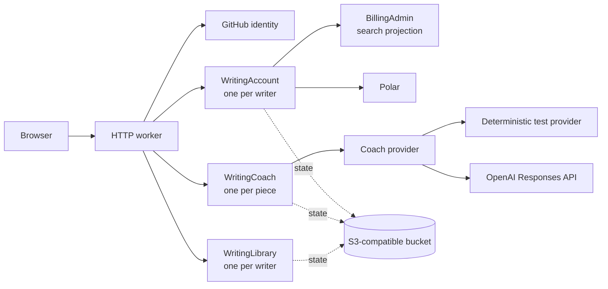

# Writing Practice on celld

Writing Practice is a persistent writing desk with an agentic coach. The coach researches a subject, leaves cited reading notes, responds to drafts, and marks exact passages without writing the piece for its author.

The application is also a compact example of running Durable Objects on infrastructure you control with [`celld`](https://github.com/denoland/celld). The [Durable Objects essay and two films](https://krasnoperov.me/posts/two-films-about-durable-objects) explain the model; the [Writing Practice walkthrough](https://krasnoperov.me/posts/writing-practice-on-celld) shows it in use.

This repository is source-available for inspection and discussion. It is not open source; see [LICENSE](LICENSE).

The deployment on Hetzner is a controlled experiment, not a public trial. The Writing Practice video is the public walkthrough.

## What the experiment shows

- one named Durable Object per piece;
- a durable page, brief, note stream, and background-job queue;
- optimistic document revisions instead of last-write-wins editing;
- alarms, leases, retries, and reconstruction after a process disappears;
- one account object per GitHub identity for entitlement, usage, and billing audit;
- a provider seam with deterministic and OpenAI implementations;
- explicit prompt contracts that keep the writer, not the model, in authorship control.

The coach never exposes an “apply” button and never writes into the page. It brings evidence, questions, editorial letters, verdicts, and anchored margin notes. The writer authors every change.

## Architecture



The boundaries are intentionally small:

- `WritingLibrary` owns a writer's list of piece IDs.
- `WritingCoach` owns one piece and serializes its state-changing decisions.
- `WritingAccount` owns subscription state, allowances, usage reservations, and the operational audit for one GitHub ID.
- `BillingAdmin` is a searchable projection. It is not a second billing authority.
- celld owns placement, recovery, and persistence to an S3-compatible bucket.

Pure state transitions live separately from runtime adapters. `src/piece-core.js` and `src/account-core.js` can be tested without celld; `src/coach.js`, `src/account.js`, and `src/worker.js` adapt them to Durable Objects and HTTP.

## Source layout

```text
src/
  worker.js             public HTTP entry point and object exports
  coach.js              per-piece Durable Object and alarm runner
  piece-core.js         pure piece, job, and note transitions
  library.js            per-writer piece index
  account.js            account and billing-index Durable Objects
  account-core.js       pure entitlement, usage, and audit transitions
  billing.js            HTTP billing orchestration
  polar.js              Polar checkout, portal, reconciliation, webhooks
  provider.js           provider selection
  providers/            deterministic demo and OpenAI adapters
  prompts.js            agent contracts, schemas, and prompt composition
frontend/               Svelte application and static privacy/pricing pages
test/                   deterministic Node tests and object fakes
scripts/                source, voice, and design-token checks
docs/                   product research and writer-facing voice contract
evals/                  model-evaluation status and intended rubric
deploy/                 scoped Hetzner examples
```

The Remotion projects, rendered films, screenshots, recovery archives, and private host configuration used while developing the experiment are deliberately not part of this repository.

## Requirements

- Node.js 22.12.0 or newer;
- `celld` 0.1.0, the version tested by this snapshot;
- an S3-compatible bucket, such as MinIO;
- a GitHub App with user authorization enabled for identity;
- Polar credentials when subscription access is enabled;
- optionally, an OpenAI API key for the live coach provider.

Pin the celld version used by a real deployment. The application configuration follows the Workers-style file in `wrangler.jsonc`, but deployment and execution are performed by celld rather than Wrangler.

## Install and verify

```sh
npm ci
npm test
npm run check
```

`npm run check` runs Oxlint, JavaScript syntax checks, the writer-facing voice contract, the OKLCH/design-token contract, and a production build.

To inspect backend line coverage:

```sh
npm run test:coverage
```

## Run locally

Copy the environment template and fill in local credentials:

```sh
cp .env.example .env
set -a
. ./.env
set +a
```

Build and deploy the worker bundle into a local S3-compatible celld store:

```sh
npm run deploy -- --bucket s3://writing-coach --endpoint http://127.0.0.1:9000
celld --bucket s3://writing-coach --endpoint http://127.0.0.1:9000 --listen 127.0.0.1:8931
```

For frontend iteration, keep celld listening on port `8931` and run:

```sh
npm run dev
```

Vite proxies `/api` and `/auth` to the local celld process.

The GitHub callback must exactly match `GITHUB_CALLBACK_URL`; for the example above it is `http://localhost:8931/auth/github/callback`. The GitHub App needs identity only: enable user authorization, but grant no repository permissions and configure no webhook events.

## Providers and prompts

`COACH_PROVIDER=demo` selects a deterministic provider and requires no model credentials. It is useful for workflow development, persistence tests, and screenshots. It does not bypass authentication or access policy.

`COACH_PROVIDER=openai` selects the OpenAI Responses API:

```text
CELLD_VAR_COACH_PROVIDER=openai
CELLD_VAR_OPENAI_API_KEY=...
CELLD_VAR_OPENAI_MODEL=gpt-5.6-sol
```

Requests use `store: false`. Research and direct factual questions may use web search. Returned URL annotations are converted into visible Markdown sources. Provider conversation state is never authoritative; every durable input needed for a later pass is stored with the piece.

The prompt layer is code, not an opaque provider configuration. `src/prompts.js` defines separate contracts for research, first reads, editorial letters, revision verdicts, direct answers, and margin notes. Structured research and review responses are validated before they become notes.

## Agent workflow

Starting a piece explicitly queues its first reading. Each later provider call begins only from a coach action the writer chooses; typing and autosave never start model work. Each request becomes a small durable job containing the relevant page revision and brief. The piece object claims due work with a lease, calls the provider, stores the resulting note, and arms the next alarm when necessary.

The current workflow supports:

```text
reading -> early writing -> first read or editorial letter
        -> writer revision and reply -> verdict
        -> optional anchored margin notes and direct questions
```

Only one coach job may be active for a piece at a time. Draft snapshots are retained only while a queued or running job references them.

## Billing

Polar supplies checkout, subscription state, and the customer portal. The browser never grants access from a successful redirect: signed webhooks or explicit reconciliation update the authoritative `WritingAccount` object.

Chargeable work reserves a session before it reaches the piece object. Idempotency keys prevent ordinary browser retries from charging twice, and completed responses can be replayed. The account keeps an append-only operational audit plus a bounded operation ledger; administrators adjust balances and reconcile provider state through the account object.

The release snapshot supports active and Polar-trialing subscriptions plus configured administrator access. There is deliberately no public grace or demo entitlement: the experiment is accessed only through the configured account policy.

Polar should send subscription lifecycle, customer state, and order events to:

```text
https://your-host.example/api/webhooks/polar
```

The handler verifies the Standard Webhooks signature over the exact request body, message ID, and timestamp before routing by the immutable numeric GitHub ID.

## Tests and evals

The deterministic Node suite covers authentication, piece isolation, deletion, alarm leases, retry gates, revision conflicts, note anchoring, webhook verification, subscription periods, usage reservations, and provider response parsing.

These are workflow and correctness tests, not model-quality evaluations. The opt-in `npm run eval:live` harness checks no ghostwriting, quote fidelity, citations, and prompt-injection resistance against a configured live model. Repository CI runs the command with `COACH_PROVIDER=demo`, which explicitly skips all live calls because they require credentials, incur cost, and are nondeterministic. See [evals/README.md](evals/README.md) for the rubric and authorization command.

Prompt changes therefore require both the deterministic suite and human review against [docs/VOICE.md](docs/VOICE.md).

## Deploy on Hetzner

The controlled experiment runs as a celld process on a Hetzner machine, behind Caddy, with state in an S3-compatible bucket. The repository contains two deliberately narrow examples:

- `deploy/celld-writing-practice.service` runs one celld node as a hardened dynamic systemd user;
- `deploy/Caddyfile.example` terminates TLS, supplies browser security headers, controls cache policy, and proxies only this application.

A typical host deployment is:

1. Install and pin celld, Node.js, Caddy, and the S3-compatible service.
2. Put runtime variables and secrets in `/etc/celld-writing-practice/env` with mode `0600`.
3. Run `npm ci`, `npm test`, and `npm run check` from the release checkout.
4. Deploy the built bundle with `celld deploy` against the production bucket.
5. Install the systemd unit, then start and enable it.
6. Adapt the example hostname in the Caddy fragment and reload Caddy.
7. Verify `/api/health`, GitHub sign-in, one persisted piece, an alarm completing after the browser closes, and a signed Polar test webhook.

Do not commit the host environment file, bucket credentials, session secret, provider keys, GitHub secret, or Polar webhook secret.

## Experiment boundary

This repository demonstrates the application and Durable Object architecture. It is not presented as a hostile multi-tenant reference implementation. Before wider production use, expand the opt-in live-model eval set, add failure-injection coverage for every cross-object billing boundary, and add explicit retention/export policy, rate limits, and operational alerting.

## License

Copyright © 2026 Aleksei Krasnoperov. All rights reserved. Public visibility grants no right to use, copy, modify, deploy, or redistribute the software. See [LICENSE](LICENSE).
